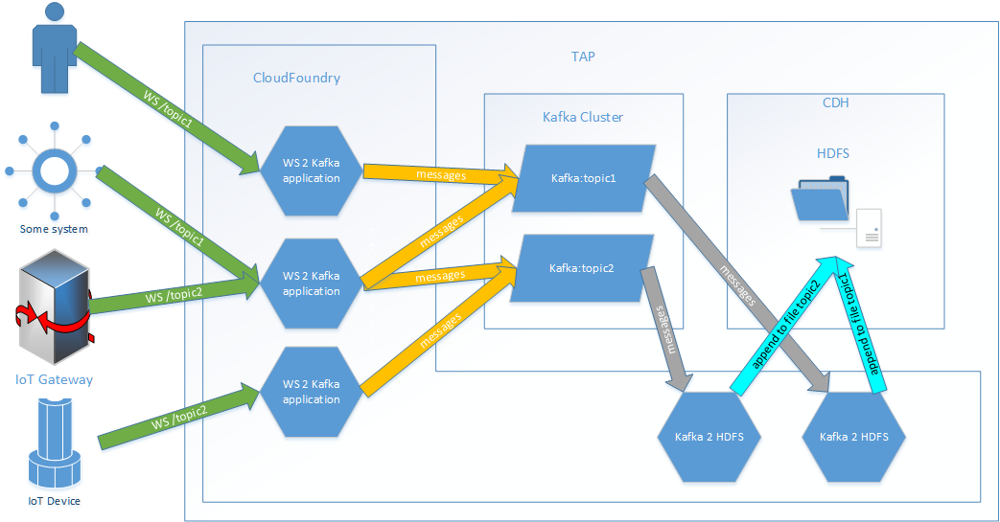

# Ingesting data WebSocket -> Kafka -> HDFS

This repository contains example on how to setup ingestion pipeline on Trusted Analytics platform. It goes like follow:



* External device/system pushes data through WebSockets (WS) application that is hosted in DP. Lets call this application **ws2kafka**.
* **ws2kafka** is pushing recieved data into Kafka. Topic is choosen based on WS URL to which connection is made, so calls looks like: ```wss://ws2kafka.some_domain.com/topic1```. For this to work, Kafka needs to be configured to automatically create topics. **ws2kafka** is horizontaly scalable, so you can have multiple instances of it.
* **kafka2hdfs** is an application that is started with predefined list of Kafka topics that it should track. For each topic it will ensure that coresponding file exists and append newly added data to it. Because it is not safe to do multiple concurrent appends to single HDFS file you shouldn't try to have multiple instances listening on the same topic.


Instruction on how to deploy each application is in its folder with more detailed instructions/notes. There is small utility script ```create_service_instances.sh``` that will create service instances.

Provided **ws2kafka** application is very simple and doesn't provide authorization. If you need something more advanced or you just feel adventurous, you might consider using [Gateway](https://github.com/trustedanalytics/gateway) but note that it enforces some kafka messages format. Nice feature of this pipeline is that you can replace one part of it with your own. Their common part is Kafka and its topics.


